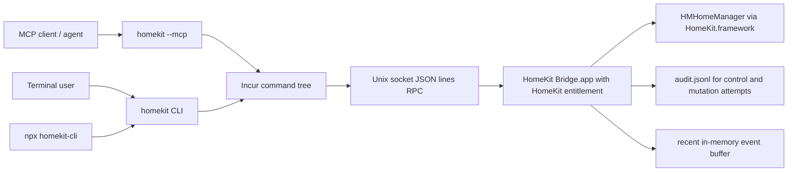

# homekit-cli

Control and inspect Apple HomeKit from the terminal, MCP clients, and agent workflows.

`homekit-cli` is a local-first HomeKit CLI and MCP server backed by a signed macOS bridge app. The bridge owns `HomeKit.framework` and the HomeKit entitlement; the Node CLI talks to it over a per-user Unix socket. The default posture is inspection-first, with physical control and structural mutations behind explicit safety flags.

## Why The CLI?

Apple HomeKit does not provide a general-purpose public CLI or a simple agent-facing API. Apps that use `HMHomeManager` need Apple entitlements, macOS signing, and user-granted HomeKit permission. That makes direct access from a Node CLI or MCP server the wrong boundary.

`homekit-cli` keeps that boundary small:

- inspect homes, rooms, zones, accessories, services, characteristics, scenes, automations, and recent events
- generate an LLM-friendly device map for agents
- expose the same command tree as a human CLI and MCP stdio server
- install a curated Codex/agent skill through the external Skills CLI
- control one exact accessory characteristic only with `--allow-actuation`
- mutate rooms, zones, scenes, automations, names, and accessory membership only with `--allow-mutation`
- audit accepted and rejected actuation/mutation attempts

It intentionally does not include a webhook listener, external callback router, TUI, or HomeKit automation side channel.

## Architecture

GitHub renders Mermaid diagrams in Markdown.



Runtime pieces:

- `HomeKit Bridge.app`: signed Mac Catalyst app with `com.apple.developer.homekit`, App Group socket, `HMHomeManager`, and the local RPC server.
- `homekit-cli`: npm package with the `homekit` binary, MCP stdio server, command schemas, and setup helpers.
- Unix socket: local-only transport. No network listener.
- Protocol: internal versioned JSON-lines RPC. CLI and bridge major protocol versions must match.

## Quick Start

Install or run the CLI:

```bash
npx homekit-cli --help
npx homekit-cli bridge setup
npx homekit-cli status
```

After installing the npm package globally or through a package manager, the binary is:

```bash
homekit status
homekit accessories list --json
homekit accessories search garage --json
homekit device-map
```

Install and launch the bridge:

```bash
homekit bridge setup
homekit bridge launch
homekit status
```

Inspect before controlling:

```bash
homekit accessories list --json
homekit accessories get <accessoryId> --json
```

Control requires exact identifiers and an explicit physical-actuation flag:

```bash
homekit accessories control <accessoryId> target_door_state 1 --allow-actuation
```

Structural mutations require `--allow-mutation`:

```bash
homekit rooms rename <roomId> "Entry" --allow-mutation
homekit zones add-room <zoneId> <roomId> --allow-mutation
```

## Install Skills

`homekit-cli` uses Incur for the command tree, MCP, schemas, and LLM manifests. The curated workflow skill is distributed as a normal Agent Skills package under `skills/homekit`, so it can include references and scripts instead of being generated from command schemas.

Install the MCP server entry:

```bash
npx homekit-cli mcp add
```

Start MCP directly:

```bash
npx homekit-cli --mcp
```

MCP config examples:

```text
examples/mcp.readonly.example.json
examples/mcp.write.example.json
```

Install the curated HomeKit workflow skill:

```bash
npx skills add l3wi/homekit-cli --skill homekit
```

Local development equivalent:

```bash
bun run build
node packages/cli/dist/bin.js --mcp
npx skills add ./skills --skill homekit --copy -y
```

The hand-written skill lives in `skills/homekit` and is installed as the canonical `homekit` skill. The internal Incur `homekit skills` command is disabled for this package so agents do not get command-dump skills.

- `homekit`: setup, inspect, read, write, scenes, automations, and safety workflows using progressive disclosure.

## CLI/MCP Surface

The CLI command tree is the MCP tool source of truth. Every command has Zod input/output schemas through Incur.

| Area        | Commands                                                                                                                                                                                                     | Default Safety                                                                                          |
| ----------- | ------------------------------------------------------------------------------------------------------------------------------------------------------------------------------------------------------------ | ------------------------------------------------------------------------------------------------------- |
| Status      | `status`                                                                                                                                                                                                     | read-only                                                                                               |
| Homes       | `homes list`                                                                                                                                                                                                 | read-only                                                                                               |
| Rooms       | `rooms list`, `rooms create`, `rooms rename`, `rooms remove`, `rooms assign`                                                                                                                                 | list is read-only; mutations require `--allow-mutation`                                                 |
| Accessories | `accessories list`, `accessories get`, `accessories search`, `accessories control`, `accessories remove`                                                                                                     | list/get/search are read-only; control requires `--allow-actuation`; remove requires `--allow-mutation` |
| Scenes      | `scenes list`, `scenes get`, `scenes import`, `scenes update`, `scenes delete`                                                                                                                               | list/get are read-only; mutations require `--allow-mutation`                                            |
| Automations | `automations list`, `automations get`, `automations create`, `automations create-time`, `automations delete`, `automations enable`, `automations disable`, `automations rewire`, `automations add-condition` | list/get are read-only; mutations require `--allow-mutation`                                            |
| Zones       | `zones list`, `zones create`, `zones remove`, `zones add-room`, `zones remove-room`                                                                                                                          | list is read-only; mutations require `--allow-mutation`                                                 |
| Rename      | `rename <kind> <id> <newName>`                                                                                                                                                                               | requires `--allow-mutation`                                                                             |
| Device Map  | `device-map`                                                                                                                                                                                                 | read-only                                                                                               |
| Events      | `events list`                                                                                                                                                                                                | read-only                                                                                               |
| Bridge      | `bridge setup`, `bridge status`, `bridge launch`, `bridge stop`, `bridge logs`                                                                                                                               | local bridge lifecycle only                                                                             |
| Agent Setup | `--mcp`, `mcp add`, `--llms`, `--schema`; skill install via `npx skills add l3wi/homekit-cli --skill homekit`                                                                                                | setup and discovery                                                                                     |

Full command coverage and current bridge implementation status: [docs/commands.md](docs/commands.md).

## Supported Accessories

Support is based on HomeKit services and characteristics exposed by each accessory. Read support is broad; write support depends on the characteristic being writable and on explicit CLI flags.

| Category                            | Read                                                                       | Control / Mutation                                                                                     |
| ----------------------------------- | -------------------------------------------------------------------------- | ------------------------------------------------------------------------------------------------------ |
| Lights                              | power, brightness, hue, saturation, color temperature where exposed        | set writable characteristics with `accessories control --allow-actuation`                              |
| Switches and outlets                | power state, service metadata                                              | set power-like writable characteristics                                                                |
| Locks                               | current/target lock state where exposed                                    | lock/unlock target characteristics                                                                     |
| Garage doors and doors              | current/target door state, obstruction where exposed                       | open/close target characteristics                                                                      |
| Fans                                | active, speed, direction, swing mode where exposed                         | set writable fan characteristics                                                                       |
| Window coverings                    | current/target position where exposed                                      | set target position                                                                                    |
| Thermostats                         | current/target temperature, mode, humidity where exposed                   | set writable thermostat targets                                                                        |
| Sensors                             | motion, contact, temperature, humidity, light level, battery, reachability | read-only unless HomeKit exposes a writable characteristic                                             |
| Doorbells and programmable switches | input/button events where exposed                                          | read-only event inspection                                                                             |
| Scenes                              | list/get/delete, schema for import/update                                  | delete implemented; import/update present in CLI schema but bridge currently returns `NOT_IMPLEMENTED` |
| Automations                         | list/get/delete/enable/disable/rewire                                      | create/create-time/add-condition present in CLI schema but bridge currently returns `NOT_IMPLEMENTED`  |
| Rooms and zones                     | list/get membership                                                        | create, rename, remove, assign membership with `--allow-mutation`                                      |

Use `homekit accessories get <accessoryId> --json` to inspect the exact services, characteristic names, writable flags, and values exposed by your devices.

## Configuration

Environment variables:

| Variable                                 | Purpose                                                                           |
| ---------------------------------------- | --------------------------------------------------------------------------------- |
| `HOMEKIT_SOCKET_PATH`                    | Override the Unix socket path.                                                    |
| `HOMEKIT_APP_GROUP_IDENTIFIER`           | Override the App Group identifier used by the CLI to resolve the socket.          |
| `HOMEKIT_USE_TMP_SOCKET=1`               | Use `${TMPDIR}/ad.blackwattle.homekit.sock` for development builds.               |
| `HOMEKIT_MCP_PROFILE=readonly\|write`    | Operator-facing MCP profile label; write safety still requires explicit flags.    |
| `HOMEKIT_DISTRIBUTION_PROFILE_SPECIFIER` | Developer ID provisioning profile name/UUID for local release builds.             |
| `HOMEKIT_NOTARY_KEYCHAIN_PROFILE`        | Notary keychain profile for local release builds.                                 |
| `HOMEKIT_SKIP_NOTARY=1`                  | Debug release script without notarizing. Do not publish skipped-notary artifacts. |

Copy `.env.example` to `.env.local` for local signing/notarization settings. Real Apple Team IDs, certificate names, profile names, and notary profile names should stay out of git.

Production socket path:

```text
~/Library/Group Containers/group.ad.blackwattle.homekit/bridge.sock
```

Development fallback:

```text
${TMPDIR}/ad.blackwattle.homekit.sock
```

### Event Log

The bridge currently keeps recent HomeKit events in memory, capped at 500 entries. Query them with:

```bash
homekit events list
homekit events list --limit 100 --json
homekit events list --since 2026-06-19T10:00:00Z --json
homekit events list --type characteristic_change --json
```

Accepted and rejected actuation/mutation attempts are persisted separately to:

```text
~/Library/Application Support/BlackwattleHomeKitBridge/audit.jsonl
```

Each accepted `control` response returns an `auditId` that can be matched with this audit log.

### Scene Import Format

Scene import/update commands accept structured actions. MCP callers pass these as structured arrays. CLI usage passes JSON for `--actions`.

```bash
homekit scenes import "Movie Night" \
  --actions '[{"accessoryId":"ACCESSORY_UUID","characteristic":"brightness","value":"30"},{"accessoryId":"ACCESSORY_UUID","characteristic":"power_state","value":"false"}]' \
  --allow-mutation
```

Action shape:

```json
{
  "accessoryId": "ACCESSORY_UUID_OR_EXACT_NAME",
  "characteristic": "brightness",
  "value": "30",
  "serviceType": "optional HomeKit service type"
}
```

Current status: `scenes import` and `scenes update` are present in the CLI/MCP schema, but the bridge returns `NOT_IMPLEMENTED` until the native scene writer is finished.

## Development

### Project Structure

```text
apps/bridge/          Mac Catalyst HomeKit bridge app
packages/cli/         npm package, homekit binary, MCP server, internal protocol
skills/homekit/       curated Agent Skill for npx skills, with references and scripts
docs/                 architecture, security, commands, runbooks, ADRs
examples/             MCP/config examples
script/               build, signing, profile, and release helpers
```

### Building

Install dependencies:

```bash
bun install
```

Run checks:

```bash
bun run typecheck
bun run test
bun run build
bun run lint
```

Build the bridge without signing to verify compilation:

```bash
bun run bridge:build:unsigned
```

Build and run the signed development bridge:

```bash
cp .env.example .env.local
$EDITOR .env.local
./script/build_and_run.sh --verify
```

Install a downloaded provisioning profile:

```bash
bun run bridge:install-profile -- /path/to/profile.provisionprofile
```

Create local release artifacts:

```bash
bun run bridge:release -- 0.1.0
```

Artifacts are written to:

```text
dist/bridge-release/artifacts/
```

### Libraries

- [Incur](https://github.com/wevm/incur): command tree, MCP mode, schemas, LLM manifests, output formatting.
- Swift + `HomeKit.framework`: native `HMHomeManager` access inside the signed bridge app.
- XcodeGen: generated Xcode project from `apps/bridge/project.yml`.
- Bun + TypeScript: workspace scripts and CLI compilation.
- Vitest: fast TypeScript unit tests.

### Gotchas

- The CLI cannot talk to HomeKit without the signed bridge app running.
- HomeKit permission is granted to `HomeKit Bridge.app`, not to Node.
- The bridge bundle id is `ad.blackwattle.homekit`.
- The app group is `group.ad.blackwattle.homekit`.
- The Xcode project is generated and ignored. Edit `apps/bridge/project.yml`, then run `bun run bridge:generate`.
- Development builds can use `HOMEKIT_USE_TMP_SOCKET=1`; production builds should use the App Group socket.
- `bridge setup` expects Launch Services to find `ad.blackwattle.homekit`, so production installs should put `HomeKit Bridge.app` in `/Applications`.
- Local release builds require both `Developer ID Application` and `Developer ID Installer` certificates, a matching provisioning profile, and notary credentials.
- Do not publish artifacts built with `HOMEKIT_SKIP_NOTARY=1`.
- HomeKit data can reveal occupancy, security devices, room layout, routines, and presence patterns. Do not commit real snapshots or unsanitized logs.

## License

MIT. See [LICENSE](LICENSE).
