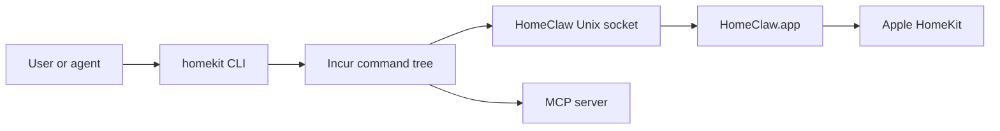

# homekit-cli

`homekit-cli` is a TypeScript CLI and MCP server for inspecting and operating Apple HomeKit through the installed [HomeClaw](https://apps.apple.com/us/app/homeclaw/id6759682551?mt=12) app.

HomeClaw owns Apple’s HomeKit entitlement, HomeKit permission prompt, and native `HMHomeManager` access. This package owns the agent-facing surface: Incur command groups, schemas, MCP tools, safety gates, docs, and `npx skills` workflow guidance.

## Why the CLI?

Apple HomeKit access is entitlement-gated. A normal Node process cannot directly use `HMHomeManager`, prompt for HomeKit permission, or read the Home database. `homekit-cli` keeps Node on the agent/tooling side and talks to HomeClaw over its local Unix socket.

That means a signed App Store or TestFlight app is a hard prerequisite. Install [HomeClaw from the Mac App Store](https://apps.apple.com/us/app/homeclaw/id6759682551?mt=12), launch it once, and approve HomeKit access before running `npx homekit-cli` or the global `homekit` binary.

HomeClaw also bundles its own CLI and MCP server. Skip setup for those bundled surfaces; this repo provides the documented `homekit` CLI, MCP server, schemas, and external `npx skills` workflow.

## Architecture



## Quick Start

Install and launch [HomeClaw](https://apps.apple.com/us/app/homeclaw/id6759682551?mt=12) first, then approve HomeKit permission in HomeClaw. Do not configure HomeClaw's bundled CLI or MCP server.

Run without installing globally:

```bash
npx -y homekit-cli bridge setup --format json
npx -y homekit-cli status --format json
```

Or install globally:

```bash
npm i -g homekit-cli
homekit bridge setup --format json
homekit status --format json
```

Run as MCP without a global install:

```bash
npx -y homekit-cli --mcp
```

Install the published workflow skill:

```bash
npx skills add l3wi/homekit-cli --skill homekit
```

## Development

Run from a local checkout:

```bash
bun install
bun run build
node dist/bin.js bridge setup --format json
node dist/bin.js status --format json
```

Run locally:

```bash
bun run dev -- --help
```

Run as MCP:

```bash
node dist/bin.js --mcp
```

Install the repo-local skill during development:

```bash
npx skills add ./skills --skill homekit --copy -y
```

## CLI/MCP Surface

| Area        | Commands                                                                                                                                                                                                     | Write gate                               |
| ----------- | ------------------------------------------------------------------------------------------------------------------------------------------------------------------------------------------------------------ | ---------------------------------------- |
| Status      | `status`                                                                                                                                                                                                     | read-only                                |
| Homes       | `homes list`                                                                                                                                                                                                 | read-only                                |
| Rooms       | `rooms list`, `rooms create`, `rooms rename`, `rooms remove`, `rooms assign`                                                                                                                                 | `--allow-mutation`                       |
| Accessories | `accessories list`, `accessories get`, `accessories search`, `accessories control`, `accessories remove`                                                                                                     | `--allow-actuation` / `--allow-mutation` |
| Scenes      | `scenes list`, `scenes get`, `scenes trigger`, `scenes import`, `scenes update`, `scenes delete`                                                                                                             | `--allow-actuation` / `--allow-mutation` |
| Automations | `automations list`, `automations get`, `automations create`, `automations create-time`, `automations delete`, `automations enable`, `automations disable`, `automations rewire`, `automations add-condition` | `--allow-mutation`                       |
| Zones       | `zones list`, `zones create`, `zones remove`, `zones add-room`, `zones remove-room`                                                                                                                          | `--allow-mutation`                       |
| Rename      | `rename`                                                                                                                                                                                                     | `--allow-mutation`                       |
| Events      | `events list`                                                                                                                                                                                                | read-only                                |
| Device map  | `device-map`                                                                                                                                                                                                 | read-only                                |
| Webhooks    | `webhooks status`, `webhooks setup`, `webhooks test`, `webhooks reset`, `webhooks log`, `webhooks log-stats`, `webhooks purge-log`                                                                           | setup/reset/purge require mutation       |
| Triggers    | `triggers list`, `triggers add`, `triggers update`, `triggers remove`                                                                                                                                        | mutations require `--allow-mutation`     |
| Provider    | `bridge setup`, `bridge status`, `bridge launch`, `bridge stop`, `bridge logs`                                                                                                                               | provider-specific                        |

`control/set` style operations remain intentionally explicit. No wildcard writes are supported.

## Configuration

| Variable                          | Purpose                                                               |
| --------------------------------- | --------------------------------------------------------------------- |
| `HOMEKIT_SOCKET_PATH`             | Optional HomeClaw socket override.                                    |
| `HOMEKIT_USE_LEGACY_TMP_SOCKET=1` | Use `/tmp/homeclaw.sock` instead of the App Group socket.             |
| `HOMEKIT_MCP_PROFILE`             | Operator label for read/write MCP profiles. Safety gates still apply. |

Default socket path:

```text
~/Library/Group Containers/group.com.shahine.homeclaw/homeclaw.sock
```

Signing, notarization, provisioning profiles, app groups, and native release scripts do not live on `main`.

If HomeClaw is not installed or not running, the CLI exits with install guidance, the expected socket path, and the App Store link.

## Project Structure

Project structure:

```text
src/                  CLI, command groups, HomeClaw socket client helpers
test/                 Vitest tests
docs/                 architecture, command, MCP, safety, and runbook docs
examples/             MCP/config examples
skills/homekit/       external npx-skills package
```

Useful commands:

```bash
bun install
bun run typecheck
bun run test
bun run lint
bun run build
```

## License

MIT
