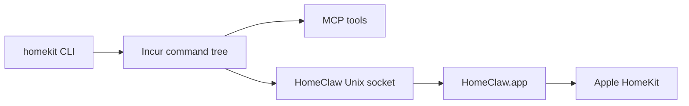

# Architecture

`homekit-cli` is a flat Node package over HomeClaw.

The CLI is intentionally not entitlement-bearing. It owns command structure, schemas, output formatting, MCP exposure, and write-safety gates. HomeClaw owns Apple HomeKit permission and native HomeKit access.

## Boundaries

- `src/cli.ts`: command tree and MCP source of truth.
- `src/commands/*`: command groups.
- `src/lib/*`: safety gates and HomeClaw socket client plumbing.
- `src/protocol.ts`: request/response types for the HomeClaw socket boundary.
- `skills/homekit`: external skill package installable with `npx skills`.

The previous native application, signing scripts, and provisioning profile flow are preserved on the `feat/application` branch only.
